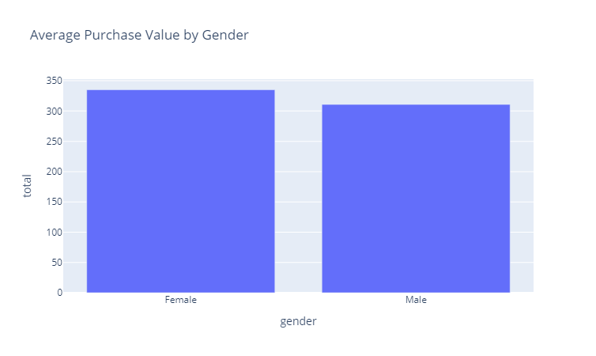
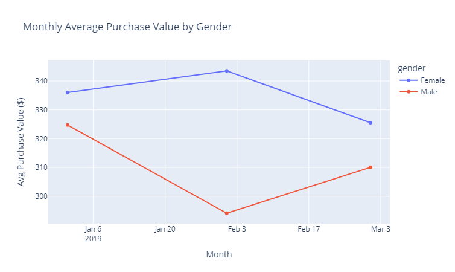
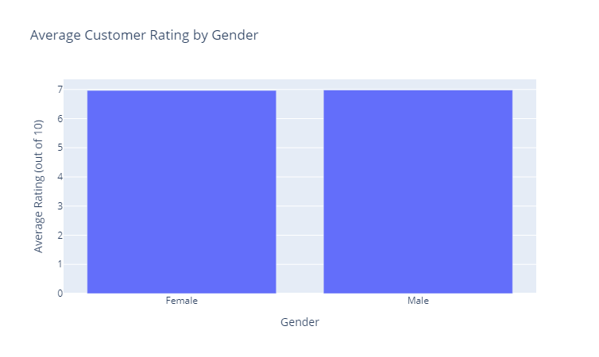
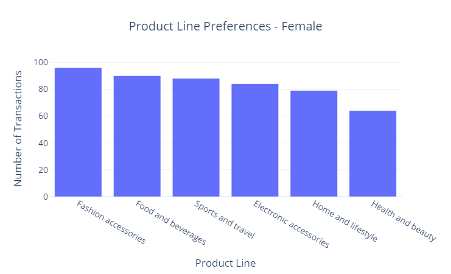
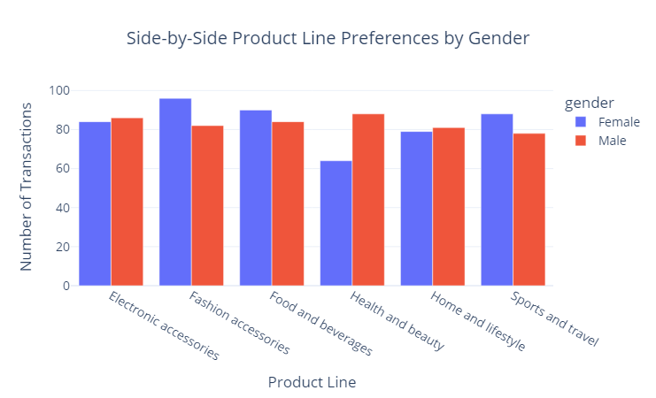

# Project 7 - Gender Based Sales Trends in Supermarket Transactions

### Section 1.  The Business Goal
This project explores consumer behavior by gender in a synthetic supermarket sales dataset.  

We use data analysis and interactive dashboards to investigate product preferences, purchase value differences, and ethical considerations in business intelligence decision-making.

### Section 2.  Dataset Source

The data used in this project comes from the Supermarket Sales dataset available on Kaggle. This dataset includes 1,000 sales transactions recorded across 3 supermarket branches, including fields like customer gender, product line, quantity, total amount, payment type, and rating. It is a synthetic dataset generated to mimic real-world business 
scenarios and is ideal for business intelligence practice.

### Section 3.  Tools Used
- Python

- SQLite (Data Warehouse)

- JupyterLab in VS Code

- pandas, matplotlib, plotly.express

- Dash (for the interactive dashboard)

- Git & GitHub for version control

### Section 4.  Workflow and Logic

### Create and Activate Project Virtual Environment

```shell
py -m venv .venv  
.venv\Scripts\Activate
```

### Add and Commit Changes to GitHub

```shell
git add .  
git commit -m  
git push -u origin main
```

### Add external dependencies

```shell
pip install jupyterlab  
pip install pandas  
pip install matplotlib  
pip install plotly  
pip install dash
```

### Create files

1.  .gitignore  
2.  README.md  
3.  requirements.txt

### Install and Set up Jupyter in VS Code

1.  Open the Project Folder: Open your root project repository folder in VS Code.
2.  Select the Python Interpreter: From the command palette (`Ctrl+Shift+P`), choose "Python: Select Interpreter" and select the `.venv` environment.
3.  Create the Notebook: Create a new file.
4.  Add a Markdown cell at the top of your notebook with the project title, author, date, and a brief purpose.

### Import Dependencies after Introduction

```shell
import pandas as pd  
import matplotlib.pyplot as plt  
import plotly.express as px  
import dash  
from dash import dcc, html, Input, Output  
import sqlite3  
```

### Data Acquisition
   - Connect to SQLite database
   - Load and merge `customer`, `product`, and `sales` tables

### Data Exploration
   - Preview merged dataset

### Section 5.  Results and Narrative
**Visualizations**

- Average purchase value by gender  
  

- Product line preferences by gender  
  

- Total revenue by gender and product line  
  

- Monthly spending trends  
  

- Average customer rating by gender  
  


**Interactive Dashboard**
   - Build interactive Dash app with:
     - Gender filter
     - Transaction count chart
     - Revenue by product line chart
     - Side-by-side comparison chart




### **Business Insights**
- Average spent per transaction is higher for female customers.
- Product preferences differ by gender:
    - Females prefer Fashion Accessories, Food & Beverages, and Sports & Travel.
    - Males prefer Health & Beauty, Electronic Accessories, and Food & Beverages.
- Revenue analysis shows different product lines dominate for each gender.
- Monthly trends show spending is more consistent for females, while males fluctuate.
- Ratings are similar between genders, suggesting no major service perception differences.


### Section 6.  Suggested Business Action
   - Targeted promotions for specific genders.
   - Inventory optimization based on popular categories by gender.
   - Product placement strategy based on shopping behavioral insights.
   - Use average spent data to offer bundles.
   - Track seasonal patterns

### Section 7.  Challenges
- Working with a synthetic dataset means trends are only representative and may not fully reflect real customer behavior.
- Limited timeframe (roughly 3 months) restricts long-term forecasting.
-Balancing interactivity (Dash app) with performance and clarity took iterative testing.

### Section 8.  Ethical Considerations
- Gender based trends can provide direction for short term planning, however, it's critical to avoid reinforcing stereotypes or overgeneralizing behavior.  

- Any gender based personalization or marketing should be inclusive, respectful, and supported by additional long-term data.
